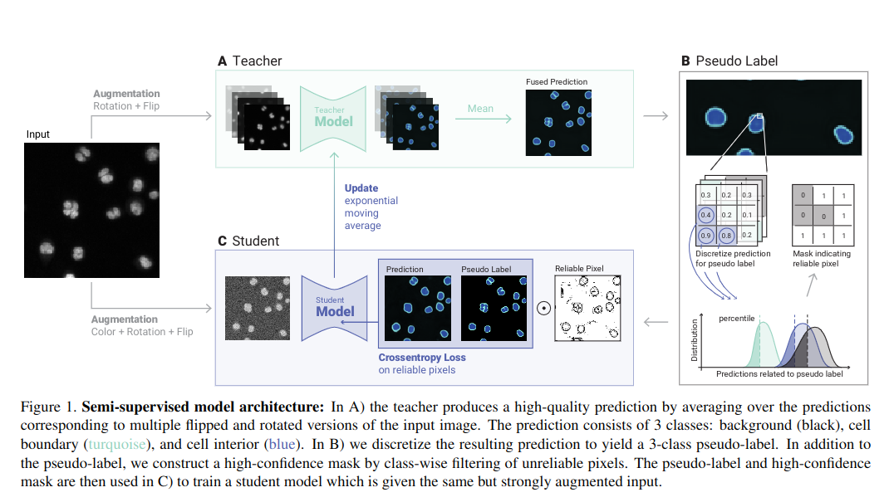

# ACTIS

Welcome to ACTIS - Augmentation Consistency Training for Instance Segmentation.

Feel free to checkout our method:

## Installation

To install the solution, follow these steps:

1. Install conda (https://docs.conda.io/en/latest/miniconda.html)
2. Create a new conda environment
   `conda create -n actis python pip`
3. Activate the environment
   `conda activate actis`
4. Clone the repository
   `git clone https://github.com/Kainmueller-Lab/ACTIS.git`
5. Install our method
   `pip install -e .`
6. use the help command to see how to use the method
   `actis -h`

## Data

The data used in our study can be found in compressed numpy format inside this repository: `data`
There are three datasets:

- Flywing
- Mouse
- DSB2018

Each dataset has the following structure:
   <Dataset>
   ├── test
   │     └── test_data.npz
   └── train
         └── train_data.npz

## Parameter file

The parameter file is a toml file that contains all the parameters needed to run an experiment.
An example parameter file can be found in `src/actis/utils/resources/parameters.toml`
The following parameters are possible.

| Variable                   | Default Value                                               | Explanation                                                                                                                                            |
|----------------------------|-------------------------------------------------------------|--------------------------------------------------------------------------------------------------------------------------------------------------------|
| base_dir                   | actis                                                       | The base directory where results should live.                                                                                                          |
| data                       | Flywing                                                     | The dataset to train on. Can be an absolut path to the data or either of "Flywing", "Mouse", "DSB2018" if paired with setting base_dir to github root. |
| checkpoint_path            | ./experiments/myexperiment/train/checkpoints/best_model.pth | Where to store your model.                                                                                                                             |
| experiment                 | myexperiment                                                | Name of your experiment.                                                                                                                               |
| num_annotated              | 19                                                          | Number of annotated labels to use.                                                                                                                     |
| batch_size_labeled         | 4                                                           | Batch size of labeled data. Total btach size will be the sum of this and the batch_size_unlabeled. Make sure they fit on your GPU.                     |
| batch_size_unlabeled       | 8                                                           | Batch size of unlabeled data. Total btach size will be the sum of this and the batch_size_labeled. Make sure they fit on your GPU.                     |
| num_workers                | 4                                                           | Number of workers to use for data loading.                                                                                                             |
| training_steps             | 50000                                                       | Number of total training steps to do.                                                                                                                  |
| in_channels                | 1                                                           | Input channels to your network architecture. Should be chosen based on your data.                                                                      |
| num_fmaps_out              | 3                                                           | Number of classes to predict.                                                                                                                          |
| learning_rate              | 0.01                                                        | Learn rate to use.                                                                                                                                     |
| seed                       | 1                                                           | Seed used for sampling.                                                                                                                                |
| semi_loss_weight           | 1.0                                                         | Weighting factor for the QuantileLoss loss.                                                                                                            |
| quantile                   | 0.2                                                         | Used for quantile loss scheduling.                                                                                                                     |
| quantile_end               | 0.1                                                         | Used for quantile loss scheduling.                                                                                                                     |
| quantile_warmup_steps      | 5000                                                        | Used for quantile loss scheduling.                                                                                                                     |
| load_student_weights       | true                                                        | Flag indicating to load student weights                                                                                                                |
| warmup_steps               | 0                                                           | Warmup steps before momentum is used.                                                                                                                  |
| fast_update_slow_model     | false                                                       | Whether to fast update teacher model.                                                                                                                  |
| size                       | 128                                                         | Affects GaussianBlur kernel size for mono color augmentations.                                                                                         |
| encoder_weights            | imagenet                                                    | Pre-trained weights used for encoder initialization                                                                                                    |
| no_moco                    | false                                                       | Do not use a slow teacher model.                                                                                                                       |
| s                          | 1.0                                                         | Affects mono color augmentations.                                                                                                                      |

## Running and evaluating experiments

Create your parameter.toml file based on your specific needs.

Then call the following command to run a supervised training experiment:

`actis train_super <path_to_parameter.toml> --log-out=<path_to_log_folder>`

To run a semi-supervised experiment, call the following command:

`actis train_semi <path_to_parameter.toml> --log-out=<path_to_log_folder>`

To evaluate any trained model call the following command:

`actis evaluate <path_to_parameter.toml> --log-out=<path_to_log_folder>`

## Citation

Please use the citation method from the [CITATION.cff](CITATION.cff) file!
You can copy it from the "ABOUT" section of your repository.

The link to the paper will be announced soon.